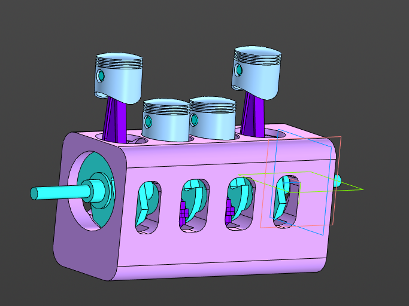

# Hackaton
Текст для анимации двигателей внутреннего сгорания.

Для 4-ех цилиндрового:
  Перед нами четырехцилиндровый двигатель внутреннего сгорания. Он состоит из следующих основных деталей: 
  1. Блок цилиндров - основа двигателя, в котором расположены четыре цилиндра;
  2. Поршни - подвижные элементы, перемещающиеся внутри цилиндров;
  3. Поршневые пальцы - соединяют поршни с шатунами;
  4. Шатуны - передают движение от поршней к коленчатому валу;
  5. Коленчатый вал - преобразует возвратно-поступательное движение поршней во вращательное;
  6. Шатунные подшипники - обеспечивают вращение коленчатого вала.
  
  Давайте посмотрим, как этот механизм работает.
  
  Сборка:
  Сначала мы устанавливаем блок цилиндров. Затем вставляем поршни в цилиндры, фиксируя их с помощью поршневых пальцев. Подсоединяем шатуны к поршням и крепим их к коленчатому валу. Теперь двигатель собран и готов к работе.
  
  Движение:
  Когда двигатель запускается, коленчатый вал начинает вращаться. Это вызывает возвратно-поступательное движение поршней внутри цилиндров. Шатуны передают это движение от поршней к коленчатому валу, приводя его во вращение. Таким образом, энергия сгорания топлива в цилиндрах преобразуется в механическое вращение коленчатого вала.
  
  Разборка:
  Для обслуживания или ремонта двигателя, мы можем разобрать его в обратном порядке. Сначала отсоединяем шатуны от коленчатого вала, затем вынимаем поршни из цилиндров, освобождая их от поршневых пальцев. В конце снимаем блок цилиндров, получая доступ ко всем деталям двигателя.

Для 8-ми цилиндрового: 
  Перед нами восьмицилиндровый двигатель внутреннего сгорания. Он состоит из следующих основных деталей: 
  1. Поршни - подвижные элементы, перемещающиеся внутри цилиндров;
  2. Поршневые пальцы - соединяют поршни с шатунами;
  3. Шатуны - передают движение от поршней к коленчатому валу;
  4. Коленчатый вал - преобразует возвратно-поступательное движение поршней во вращательное;
  5. Шатунные подшипники - обеспечивают вращение коленчатого вала.
  
  Давайте посмотрим, как этот механизм работает.
  
  Сборка:
  Начинаем с установки коленчатого вала. Затем в каждый цилиндр вставляется поршень, который соединяется с шатуном при помощи поршневого пальца. Шатуны крепятся к коленчатому валу с помощью шатунных подшипников.
  
  Движение:
  Когда двигатель запускается, топливо смешивается с воздухом и сгорает в цилиндрах, вызывая возвратно-поступательное движение поршней. Шатуны передают это движение коленчатому валу, заставляя его вращаться. Вращение коленчатого вала преобразуется в крутящий момент, который передается на трансмиссию автомобиля.
  
  Разборка:
  Для обслуживания или ремонта двигателя, мы можем разобрать его в обратном порядке. Сначала отсоединяем шатуны от коленчатого вала, затем вынимаем поршни из цилиндров, освобождая их от поршневых пальцев.
